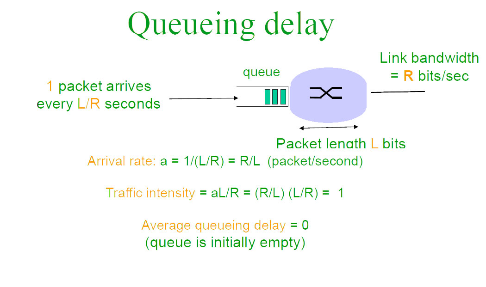
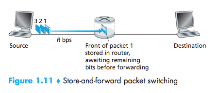
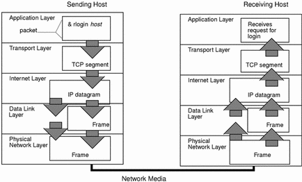

#Networks Module 1

# Internet and Core Networks
The internet is made up of access and core networks. Generally users subscribe to an access network provider and those providers network with each other via core networks. 
## Access Networks:
- Access networks connect users with first POP (point of presence)
- Also Known as Last Mile
- Usually the slowest connection and bottleneck
- A few common types include:
    - dialup
    - copper
    - fiber
    - wireless
## Dial Up Access:
- Enables internet over phone line
-  Uses analog modems, converts D/A -> A/D
- Highest rate of 56kbps actual speeds hit 33.6 kbps
- 2.1 million users in USA

## xDSL (Digital Subscriber Line):
- High speed and always available
- uses phone lines like dial up but better
#### xDSL variants and speeds

|Variant|Down/up (mbps)|comment|
|---|---|---|
|ADSL|24/3.3|12mbps/2.5km|
|VDSL|3|40mbps/500m|
|VDSL2|200/100| Used with fttc|

## Cable Access Network:
- 194 million cable tv households in US
- Uses coas and cable modems
- Raw speed of 30mbps but shared medium so can depend on number of subscribers

## DOCSIS:
- Protocol that cable modems use to talk to ISP
- Stands for:
    - Data
    - Over 
    - Cable
    - Service
    - Interface
    - Specification

|DOCSIS version|Speed u/d|
|---|---|
|2|40mbps/30mbps|
|3|1gbps/200mbps|
|4|10gbps/1g|

## Fiber Optic Access Network
- Uses optic fiber for network
- 1g d/u speeds common
- 802.3au 10g @ 20km
- Fiber terms:
    - OLT:Optical Line Unit
    - ONU:Optical Net Unit
    - PON: Passive Optical Network

## Fixed Wireless:
- Requires Line Of Sight
- Speed 5-50m @ 10 Miles
- Wifi can also be used bit its weak and insecure

## Other Access networks:
- GEO - Geosynchronous orbit satelites
- LEO - Low Earth Orbit satelites, up 100mbps speeds possible
- Cellular networks, 3,4,5g

---

## Core Communication Methods:
#### Circuit switching:
- Clients are switched between each other via physical switch multiplexing
- Generally analog signals
- Was how old telephone systems worked.
#### Circuit Switching Pros:
- Fully e2e communication as circuit is continous e2e
- Perfomance garunteed
- Ordering of messages preserved
- Used by telephones, not computers

#### Circuit Switching Cons:
- Wasteful for sporadic (bursty) traffic
- Long setup tim

#### Packet Switching:
- Messages are broken up into discrete packets and shuffled around the network.
- Digital Circuitry makes this possible
#### Packet Switching Pros:
- Continious Connection not needed
- Hosts break messages up into packets and the packets are routed to their destination
- Good for sporadic communication
- Protocols are able to handle things like delay, ordering and loss

#### Packet Switching Cons:
- More equipment overhead
- Congestion can be an issue in network topology
- Every node needs to buffer packets both in and out

### Why is packet switching more efficient?
- Link capacity in a circuit switched network is fixed for each user.
- For example, if a circuit network has a capacity of 1mbps, and each user needs minimum 100kbps the network could only support 10 users max
- Cicruit switching has a longer setup time as a link has to be established before any message can get through
- Packet switching on the other hand can rely on users not using the link at any given time and can probabalistically multiplex
- Allows for more users without performance loss
---

## Network Delay model:

### Network Delay model terms:
- Processing delay: time for examining packet for errors or routing
- Transmission delay: Time taking to push packet onto link
- Propogation Delay: Time taken for signal to travel on link from one node to another
- Queuing Delay: If arrival rate > transmission rate, packets will queue in output buffer

### Store and forward Transmission:

- L = bits per packet, R= data rate
- Router stores full packet before forwading
- Router takes L/R seconds to push out L bit packet into link at R bps

### Littles Theorem:
##### K = $\lambda$T where:
- K = Average number of items in system
- $\lambda$ = Average arrival rate
- T = Waiting time of item

##### Littles Theorem in a complex network:
###### T = $\Sigma Ki/\Sigma\lambda i$

### Network Perfomance Metrics:
- Bandwidth: The max transfer capacity of a network
- Throughput: Amount of Data that can be transferred from src-->dest in a given timeframe

### Protocols:
#####Definition of Protocol: A set of rules and procedures that define communication between 2 or more devices over a network.

##### Protocols define how data is formatted, segmented, packaged, addressed, reliably transported, securely delivered, corrected and presented

### Layering:
- Protocols are complex so in order to reduce complexity they are layered.
- This allows for the protocols to be scoped to a particular use
- This allows for modularity of protocols.
- This allows for development of different layers without affecting others
- Makes implementation and changes of protocols easier

### ISO/OSI 7 Layer Model:
- In the OSI model each layer provides services to the higher layer in a "network stack" of sorts
- Layers encapsulated and unencapsulate data
- Layers at both ends exchange PDUs (Protocol Datagram Units) which are the Payload + Headers.

|OSI Layers|
---
|1. Physical|
|2. Data Link|
|3. Network
|4. Transport 
|5. Session
|6. Presentation
|7. Application

## Functions Of OSI Layers

|Layer|PDU|Function|
|---|---|---|
|1. Physical|Bits|Define interfaces, connectors and physical medium
|2. Datalink|Frames|Reliable data transfer on single link, error detection, relieve congestion.
|3. Network|Packets|E2E logical addressing, routing and traffic control
|4. Transport|Segment/Datagram|E2E Communication between devices, contains TCP which is connection oriented and UDP which is connectionless
|5. Session|Message Data|Allows applications to establish and manage dialog and track recieved bytes
|6.Presentation|Message Data|Formatting, encryption, content translation
|7.Application|Message Data|API to support File Transfer, printing, browsing and DNS

### Message Encapsulation:
- Packets are encapuslated with the message and a header
- As data is sent through each layer it accrues headers for each layer
- As it goes back up the stack this process is reversed. 
