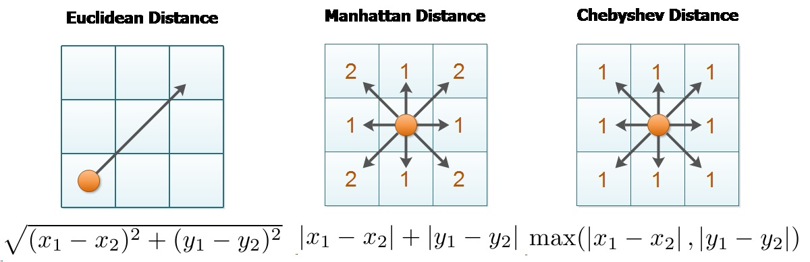

# Data Mining Module 1 
- What is data mining?
- Data mining is the study of data to discorver patterns and trends through statistical and artificial intelligence means.

## What kind of methods are common to data mining?
- Pattern Analysis/recognition
- statistical estmations

### Definition of "learning"
#### - "learning" is the iterative process by which you improve and estimate incrementally
#### - Non-iterative methods aren't really "learning"

### Data "mining" is the search for particular paterns in data
## Data Mining and ML methodds and categories:
### - Learning:
    - Supervised, eg classification and regression
    - Unsupervised, eg clustering, evolutionary algorithms

### More about a data:
- Can be discrete or continious
- Data can be switched from one form to another

### Classification Problem:
Lets say you have a table of attributes like this recording
a students name, other attributes and whether or not they got a scholarship:

|student|x|y|z|result|
|---|---|---|---|---|
|ben|a|b|c|no|
|greg|x|y|z|yes|
|sam|d|e|f|?|

Classification is the method by which you take the existing data, 
and use the old results to try to predict what the result of sam will be. 

- Form of supervided learning
- Algorithms try to figure out how to estimate the result column

## Regression Problem:
- Given a table of continious variables, figure out a discrete value
EX:

|student|x|y|z|res|amt|
|---|---|---|---|---|---|
|greg|a|b|c|y|500|
|ben|d|e|f|n|0|
|sam|x|y|z|y|250|
|matt|e|r|p|y|?|

Figure out the value of amt for matt

### Unsupervised learning:
- Given a bunc of points, sort data into clusters

### Discretization and Binarization of Continous Data:
- For example temperature (a continious varible) can be sorted into (high,med,low) ranges
- partitioning intervals to come up with a discrete value

### Types of Attributes:
#### - Nominal:
    - Attributes with no logical order
#### - Ordinal:
    - Attributes  with a logical order
#### - Interval:
    - Attributes with a number range
#### - Ratio:
    - Some kinda ratio between two quantities 
    - Ratio Atrributes are most general

|Attribute Category|Attribute Type|Description|Examples|Operations|
|---|---|---|---|---|
|Categorical|Nominal|Nominal Attributes only distiguish|Zip codes, id numbers|mode,entropy,contigency,correlation,$x_2$ test|
|Categorical|Ordinals| Ordinals atrribute values and oder objects (<,>)|(high,med,low) grades, street numbers| median, percentiles, rank, correlation, run tests, sign tests|
|Numeric |Interval|For interval attributes, differences between values are meaningful|calendar dates, temperature in C or F|mean, standard deviation, pearsons correlation, t and F tests|
|Numeric|ratio|for ratio variables both diffences and ratios are meaningful (*,/)|Temperature kelvin, age, mass, length| geometric mean, harmonic mean, percent mean|

### Similarity and Dissimilarity Measures:
- Similarity measures
    - Numerical measures of how alike two data objects are.
    - Is higher when objects are more alike
    - Often falls in the range [0,1]
- Dissimilarity Measure:
- Numerical measure of how different two data objects are
- lower when objects are more alike
- minimum dissimilarity is often 0
- upper limit varies
- Proximity refers to a similarity or dissimilarity

### Similarity/Dissimilarity of Simple Attributes:
The following table shows the similarity and dissimnilarity between two objects x and y with respect to a single simple attribute

|Atrribute Type|Dissimilarity|Similarity|
|---|---|---|
|Nominal|$d=1$ ? $x!=y$ : $0$ |$s=1$ ? $x=y$ : $0$|
|Ordinal|$d = abs(x-y)/n-1$|$s = 1-d$|
|Interval or Ratio|$d = abs(x-y)$|$s = -d,s=1/(1+d),s=e^{-d},s=1-d-min_d /(max_d - min_d)$|

### Euclidean Distance
### $d(x,y) = \sqrt{\sum{(x_k-y_k)^2}}$

where n is number of dimensions (attributes) and $x_k$ and $y_k$ are respectively the $k$th attibutes (components) of data objects x and y

### Minkowski Distance
### $d(x,y) = (\sum{abs(x_k - y_k)^r})^{1/r}$
- where $r$ is a parameter, $n$ is the number of dimensions and $x_k$ and $y_k$ are repectively the $k$th atributes of data objects $x$ and $y$

- Is a generalized form of euclidian distance, look at $r=2$
- The $r >1$ otherwise the metric violates the triangle inequality

- EX: take three points (1,2),(5,11),(2,3) use $r=0.5$ 
- Basically the two sides of a triangle cannot be to long for the third
- $dist(a,c) + dist(c,b) < dist(a,b)$, violating triangle inequality
- Can be used for any number of dimensions
- L_0 norm
- $L_0(a -b) =$ number of non-zero elements in the difference vetor (a-b)
- A special case of the $L_1$ norm is the hamming distance between binary vectors (bitstrings)

- Hamming distance is just the bumber of bits different in two bitstrings
- 
- At each bit string the difference can be $1 - 0$ or $0 -1$
- Applied to a bitstring there will be a match or a mistmatch of a zero or one, outputting another bitstring
- Therefore the L_1 norm is the hamming distance  
- The L_max norm is the chebysev distance or the minimum number of moves a king has to move for a king to move from one square to another on a chessboard

### Common Properties of Distance
- Distances have 3 properties:
1. $d(x,y) \gt= 0$ for all x and y and $d(x,y) =0$ only if $x=y$ (positive definitess)
2. $d(x,y) = d(y,x)$ for all x and y (symmetry)
3. $d(x,z) \lt= d(x,y) + d(y,z)$ for all points x, y and z (triangle inequality)

- A distance that satisfies these properties is a metric

### Similarity Between binary vectors:
- Common situation is that objects x and y have only binary attributes
- Compute similarities using the following quantities:
     - $f_{01}$ = number of attributes where x was 0 and y was 1
     - $f_{10}$ = number of attributes where x was 1 and y was 0
     - $f_{00}$ = the number of attributes where x was 0 and y was 0
     - $f_{11}$ = the bumber of attributes where x was 1 and y was 1
- Simple matching and Jaccard coefficients
    - SMC = number of matches/number of attributes
    - $= (f_{11} + f_{00})/(f_{01} + f_{10} + f_{11} + f_{00})$
    - $J = $number of 11 matches/number of non-00 attributes
    - ignore 00 matches

    